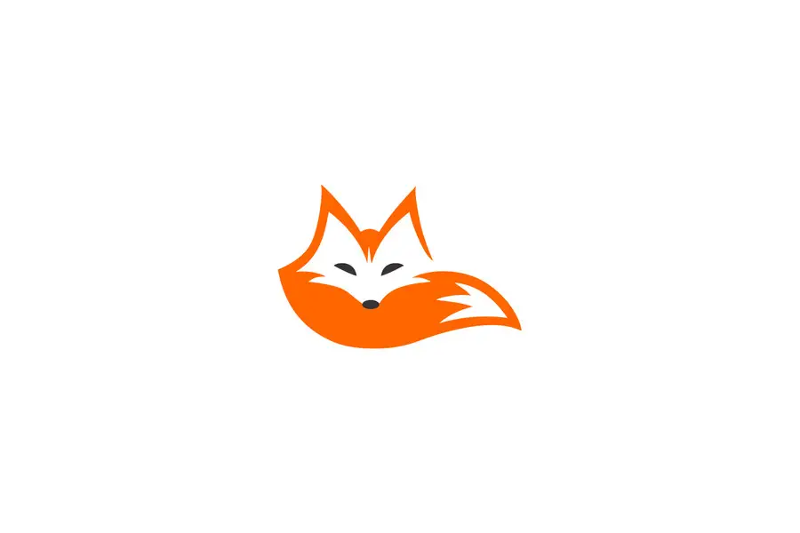
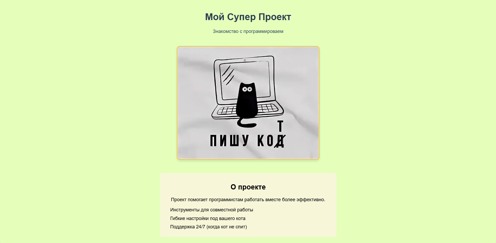

# Мой Супер Проект

Это мой учебный проект. Он представляет собой сайт для ознакомления. Простой и понятный HTML-сайт, который можно легко запустить и посмотреть в любом браузере.

### Для использования необходимо:
*   Любой современный браузер (например, Chrome)
*   Текстовый редактор (достаточно Блокнота, но лучше VS Code)

### Установка:
1.  Скачайте архив с проектом.
2.  Распакуйте его в любую папку.
3.  Запустите файл `index.html` в браузере.

## 5. Порядок использования

### Как запустить проект:

1. Найдите файл `index.html`** в папке `src`
2. Кликните на него два раза** - он откроется в вашем браузере
3. Сайт запущен и готов к просмотру

### Что можно делать на сайте:
Листать страницу, чтобы увидеть всю информацию
Нажимать на ссылки (если они есть) для перехода по разделами
Читать текст 

### Если хотите изменить сайт:
Откройте папку с проектом в программе VS Code.
Найдите и откройте файл `index.html`.
Внесите нужные изменения в код или текст.
Сохраните файл (`Ctrl + S`).
Обновите страницу в браузере (`F5` или `Ctrl + R`), чтобы увидеть изменения.

### Нужна помощь?
Если что-то не работает нужно просто открыть  файл `index.html` прямо в браузере через меню "Файл" и "Открыть"

### Скриншот
Так выглядит главная страница проекта:

